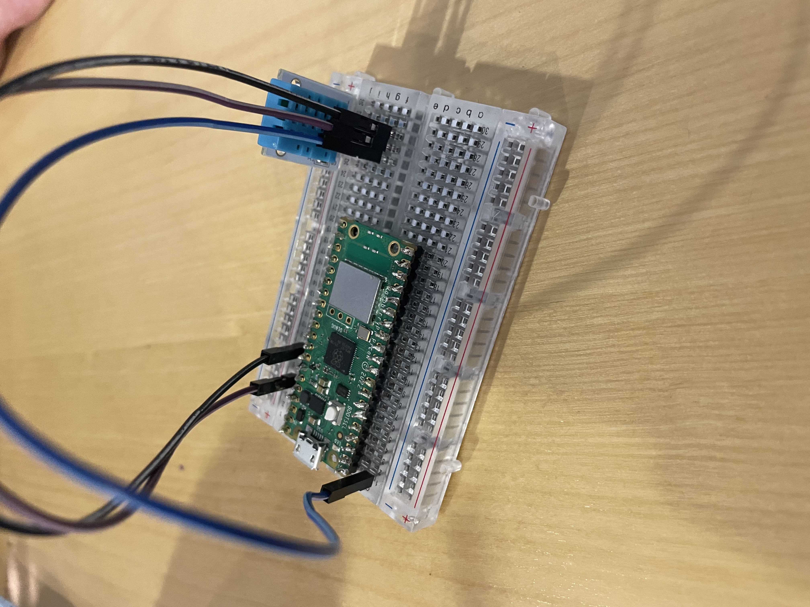
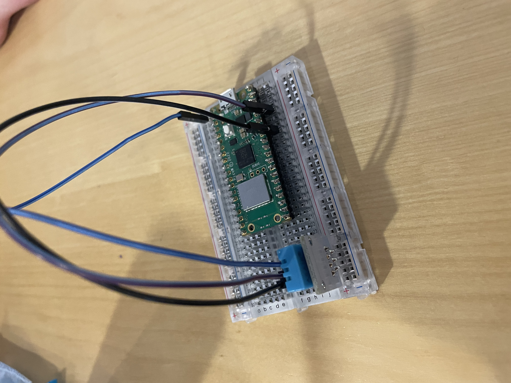

# Hardware 
## Raspberry pi

## Breadboard

## Temperature sensor - DHT11
The temperature sensor DHT11 is a digital temperature sensor which
## Hardware connection
Using wires to connect pin number xx to DHT11 sensor with the xx pin on the sensor. The xx pin on the sensor is then connected to the 3v3 output pin on the raspberry pi and the xx pin is connect to the ground pin on the raspberry pi.

