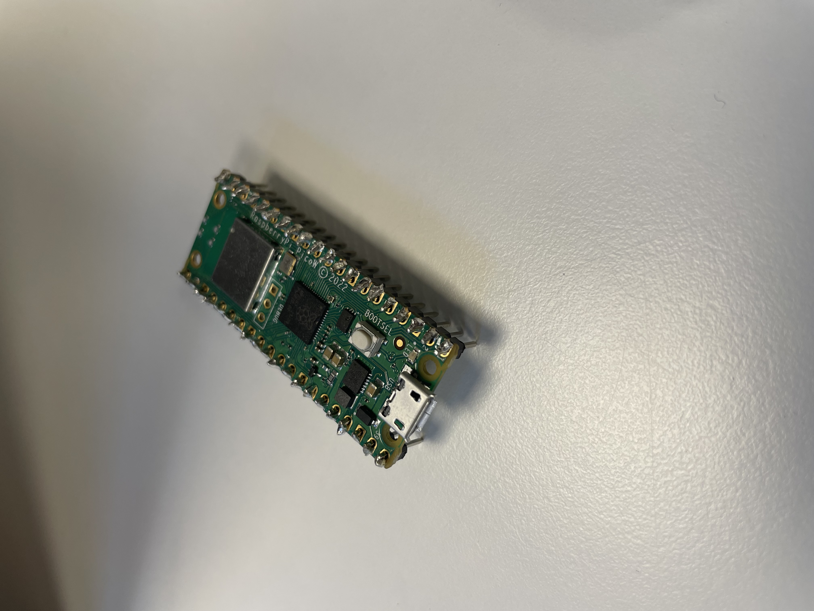
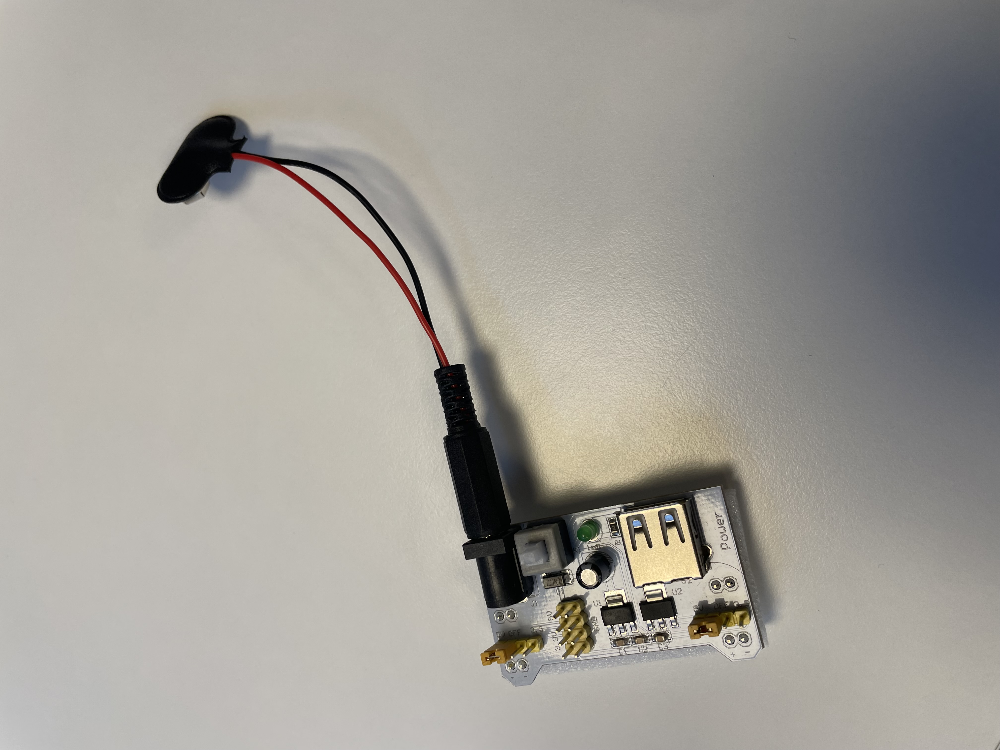
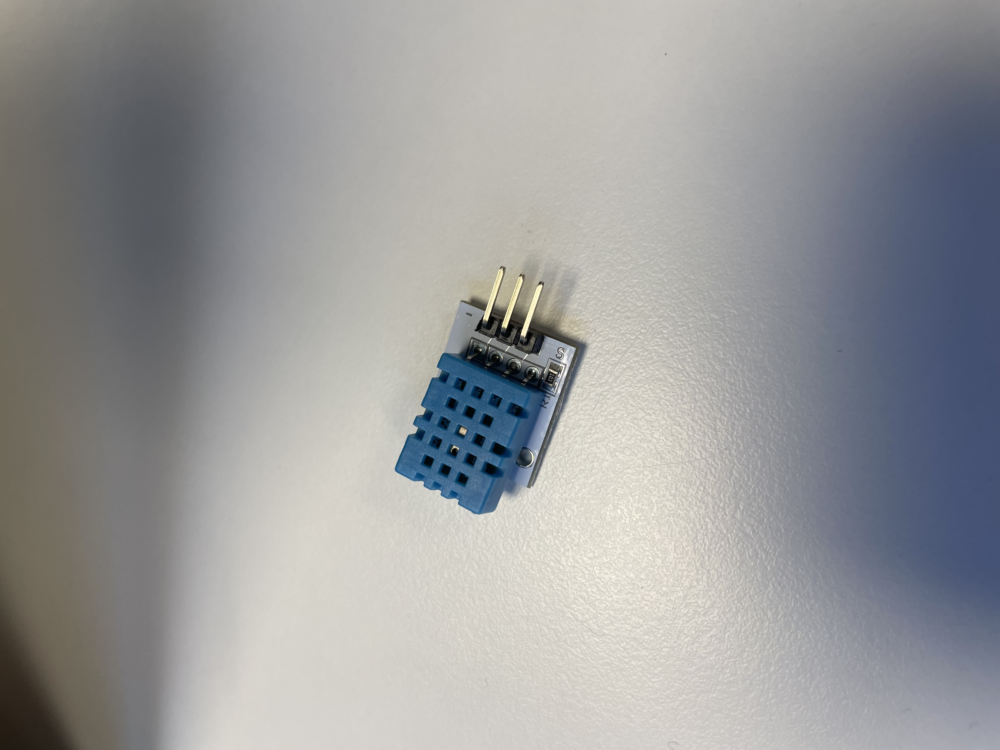
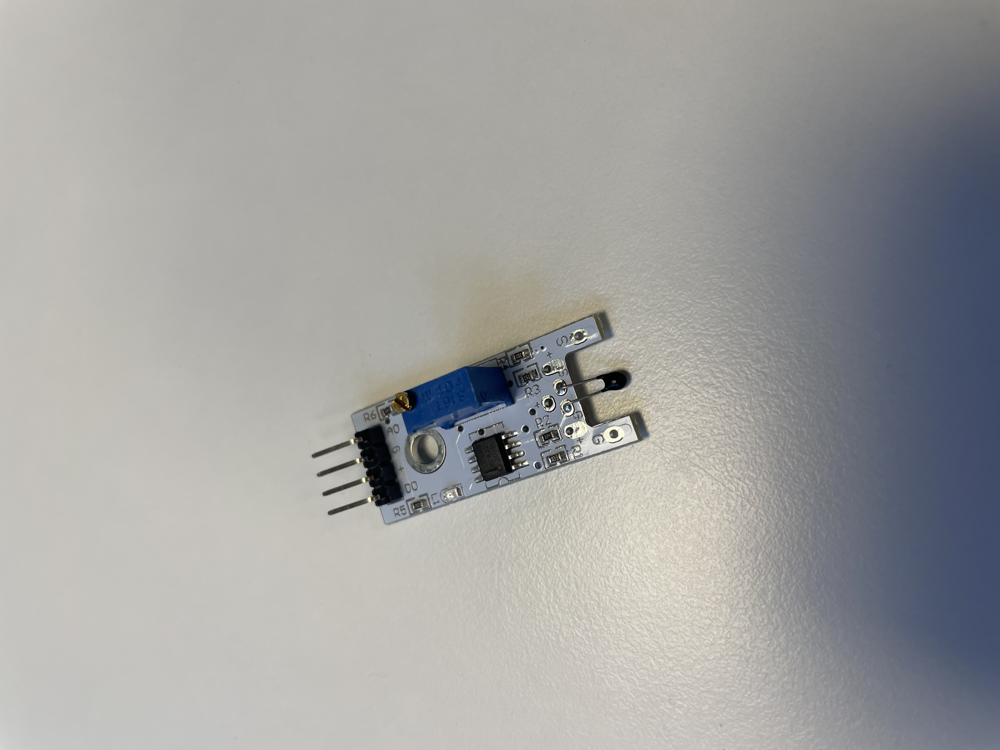
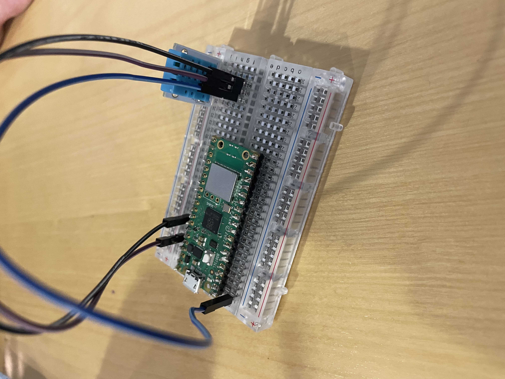
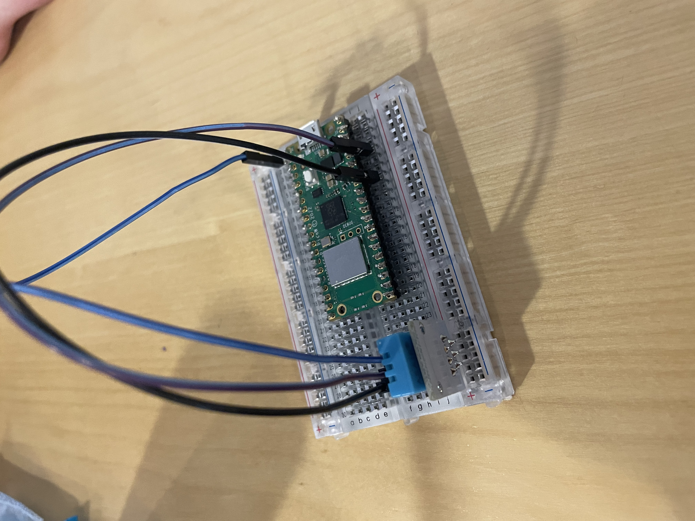

# Hardware 
## Raspberry pi
A raspberry pi is a small, low-power computer that is about the size of a credit card. It is made up of a single-board, which means all of the computer's components, including the processor, memory and input/output ports, are all contained on a single circuit board. It is commonly used in DIY projects, educations and industrial applications. It is a low cost and versatile computer that can be used for a wide range of applications.

## Breadboard
A breadbord is a type of prototyping board that is commonly used in electronics and computer science. It is called a "breadbord" because it is often used as a platform to build temporary circuits, much like how a baker might use a wooden board to shape dough. A breadbord is a rectangular board with a series of holed drilled into it. These holes are arranged in a grid, and are designed to accept the leads of electronic components such as resistors, capacitors and integrated circuits. By inserting these components into the breadbord and connecting them with jumper wires, it is possible to quicly build and test electronic circuits without the need for soldering. The allowance for easy experimentation makes the breadbord a popular choice for developing and testing new ideas.

### Breadbord power supply
A breadbord power supply is a device that provides electrical power to a breadbord. It typically provides a regulated DC voltage, such as 9V or 5V, and is used to power electronic components on the breadboard. Some breadboard power supplies also have built in power distribution, which means that they can distribute power to multiple breadboards at the same time.

## Sensors
### Temperature and humidity sensor - DHT11
The DHT11 is a commonly-used temperature and humidity sensor. It is a small, low-cost device that can be used to measure the ambient temperature and humidity in a room or enclosure. The DHT11 uses a capacitive humidity sensor and a thermistor to measure the ambient temperature and humidity. It is relatively accurate, but not as precise as some other temperature and humidity sensors on the market. It is often used in applications where a general idea of the temperature and humidity is sufficient, such as in home automation systems or weather stations. 

### Temperature sensor - KY-028
The KY-028 temperature sensor is a device that is used to measure tmeperature. It typically consists of a thermistor, which is a type of resistor that changes resistance based in changes in temperature, and an smplifier circuit that converts the change in resistance into a change in voltage or current. This cahnge in voltage or current can then be measured and used to determine the temperature.

# Hardware connection
Using wires to connect pin number xx to DHT11 sensor with the xx pin on the sensor. The xx pin on the sensor is then connected to the 3v3 output pin on the raspberry pi and the xx pin is connect to the ground pin on the raspberry pi.

