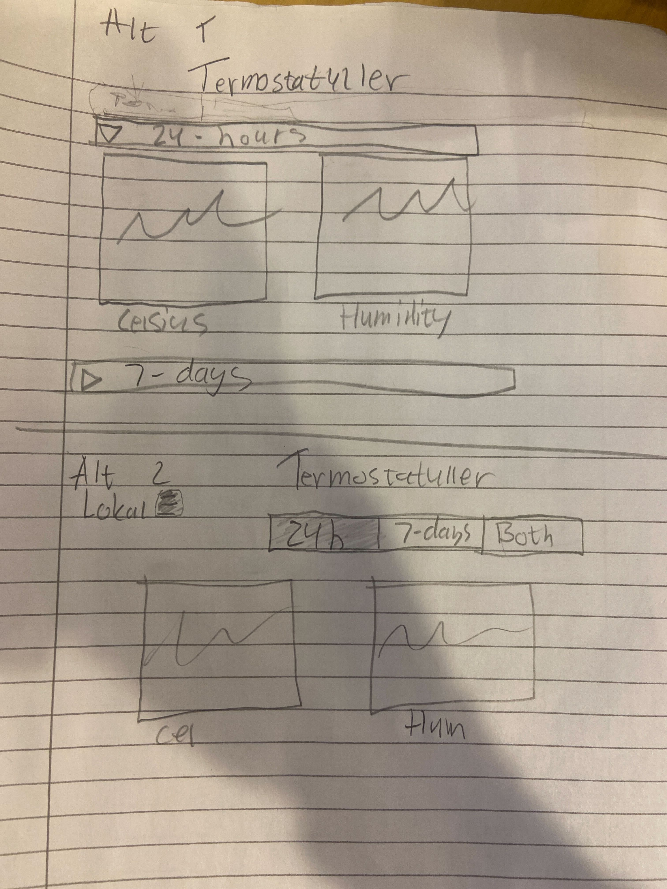

# Timelog Termostatuller

 ### 2022-12-08, Jesper, Love and Samuel, 5 hours.
 - Getting the project started with hardware connections and gitlab file management. Working with the database server that was setup. Started planning the look of the website and which functions it should include.
 - 
---
### 2022-12-09, Love and Samuel, 1 hour.

- Worked on connecting the pico to our dummy_sql sevrer to be able to push data given by the sensors to our database.

### 2022-12-11, Jesper and Samuel, 3 hours.

- Worked on getting the second sensor to work properly.
- Worked on getting the website to present charts not there yet.
- Worked on hardware and time schedule.

### 2022-12-12, Jesper, Love and Samuel, 4 hours.

- Started getting the framwork for testing the product and writing the hardware descriptions
- Worked on the connection between the website and the server

## 2022-12-14, Jesper, Samuel, 3 hours.

